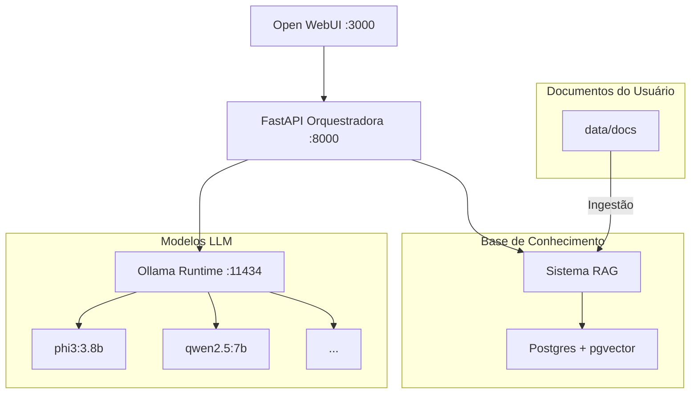

# Escrita Sincerta LLM - Starter Pro
### Sistema LLM local completo com agentes especializados, RAG vetorial e interface web


---

### 🎯 Visão Geral
Sistema LLM 100% local que implementa o Manifesto **"Escrita Sincerta"** - comunicação direta, técnica e honesta. Inclui agentes especializados, memória vetorial persistente com `pgvector` e uma interface web intuitiva para interação. O projeto é totalmente containerizado com Docker para garantir reprodutibilidade e facilidade de setup.

### ✨ Características Principais
🔒 **100% Local**: Sem dependência de APIs externas, garantindo privacidade e controle total.
🤖 **Agentes Especializados**: Use agentes pré-configurados para tarefas específicas.
📚 **RAG com pgvector**: Enriqueça o conhecimento do LLM com seus próprios documentos (PDFs, TXT, MD).
💾 **Memória Persistente**: A base vetorial `pgvector` armazena o conhecimento de forma duradoura.
🚀 **Execução com Docker**: Ambiente padronizado e de fácil manutenção com `docker-compose`.
🔧 **Multiplataforma**: Funciona em Windows, Linux e macOS.
🔀 **Suporte a Múltiplos Modelos**: Flexibilidade para alternar entre modelos como `phi3`, `qwen` e outros suportados pelo Ollama.

### 🚀 Início Rápido
**1. Pré-requisitos**
- [Docker](https://www.docker.com/products/docker-desktop/) e Docker Compose
- `git` para clonar o repositório

**2. Instalação e Execução**
```bash
# 1. Clone o repositório
git clone https://github.com/rennanfayzer/Local-AI.git
cd Local-AI

# 2. Configure o ambiente
# Copie o arquivo de exemplo e ajuste as variáveis se necessário
cp .env.example .env

# 3. Inicie todos os serviços com Docker
# Isso irá construir as imagens e iniciar os containers
make up

# 4. Baixe os modelos LLM definidos no .env
make pull
```

**3. Acessos**
- 🌐 **Interface Web**: [http://localhost:3000](http://localhost:3000) (Porta configurável em `.env`)
- 🔌 **API**: [http://localhost:8000](http://localhost:8000)
- 📊 **Documentação da API**: [http://localhost:8000/docs](http://localhost:8000/docs)

---

### 🏗️ Arquitetura
A arquitetura foi desenhada para ser modular e escalável, utilizando Docker para orquestrar os serviços.



#### 🧱 Componentes
| Serviço | Responsabilidade |
|---|---|
| **FastAPI** | Orquestração, exposição de agentes, RAG, e endpoints de controle. |
| **Ollama** | Runtime local para os modelos de linguagem (LLMs). |
| **Open WebUI** | Interface de chat estática para interagir com a API. |
| **Postgres + pgvector** | Banco de dados vetorial para o sistema RAG e memória persistente. |

---

### 🤖 Agentes Especializados
O sistema conta com agentes que possuem personalidades e especialidades distintas, definidas via *system prompts*.

- **🧠 Reflexivo**
  - **Modelo**: `phi3:3.8b` (otimizado para análise rápida).
  - **Especialidades**: Análise de problemas, planejamento estratégico, decomposição de tarefas e tomada de decisões.
  - **Capacidades**: Ideal para organizar ideias, avaliar riscos e criar planos de ação.

- **🔧 Dev Fullstack**
  - **Modelo**: `qwen2.5:7b` (equilíbrio entre velocidade e capacidade).
  - **Especialidades**: Python, JavaScript, APIs, debugging e desenvolvimento geral.
  - **Capacidades**: Geração de código, revisão, refatoração e testes.

---

### 📋 Comandos Disponíveis
A automação é gerenciada via `Makefile` para simplificar as operações mais comuns.

| Comando | Descrição |
|---|---|
| `make help` | Lista todos os comandos disponíveis no Makefile. |
| `make up` | Inicia todos os serviços em modo detached (`docker compose up -d`). |
| `make down` | Para todos os serviços (`docker compose down`). |
| `make pull` | Baixa os modelos LLM definidos no arquivo `.env`. |
| `make ingest` | Processa e indexa os documentos da pasta `data/docs` no `pgvector`. |
| `make logs` | Mostra os logs de todos os serviços em tempo real. |
| `make logs-api`| Mostra os logs específicos da API FastAPI. |
| `make status` | Exibe o status atual dos containers Docker. |
| `make reset` | **(CUIDADO)** Para os serviços e remove os volumes, incluindo a base vetorial. |

---

### 🔧 Configuração
A configuração principal é feita através do arquivo `.env`.

| Variável | Descrição | Exemplo |
|---|---|---|
| `OPENWEBUI_PORT` | Porta para a interface web. | `3000` |
| `API_PORT` | Porta para a API FastAPI. | `8000` |
| `SMALL_MODEL` | Modelo leve para tarefas rápidas (agente Reflexivo). | `phi3:3.8b` |
| `GENERAL_MODEL`| Modelo geral para desenvolvimento (agente Dev). | `qwen2.5:7b` |
| `HEAVY_MODEL` | Modelo pesado para tarefas complexas (uso futuro). | `llama3.1:8b-instruct` |
| `POSTGRES_USER` | Usuário do banco de dados. | `sincerta` |
| `POSTGRES_PASSWORD`| Senha do banco de dados. | `escrita_segura_2024` |
| `POSTGRES_DB` | Nome do banco de dados. | `sincerta_memory` |
| `RAG_TOP_K` | Número de documentos relevantes a retornar na busca vetorial. | `5` |
| `RAG_CHUNK_SIZE`| Tamanho dos pedaços de texto ao dividir documentos. | `1000` |
| `EMBEDDING_MODEL`| Modelo de embedding para o RAG. | `bge-m3` |

---

### 📚 Sistema RAG (Retrieval-Augmented Generation)
**Como Funciona**
1.  **Ingestão**: Documentos da pasta `data/docs` são divididos em pedaços (`chunks`), transformados em vetores (`embeddings`) e armazenados no `pgvector`.
2.  **Busca**: Uma pergunta do usuário é convertida em um vetor e usada para encontrar os `chunks` mais relevantes no banco de dados.
3.  **Resposta**: O LLM recebe a pergunta original junto com o contexto dos `chunks` encontrados para formular uma resposta enriquecida.

**Tipos de Arquivo Suportados**
- 📄 Markdown (`.md`)
- 📝 Texto (`.txt`)

**Uso do RAG**
```bash
# 1. Adicione seus documentos na pasta data/docs
cp meus-documentos/* data/docs/

# 2. Execute o comando de ingestão
make ingest
```
Após a ingestão, os agentes usarão automaticamente o conhecimento dos seus documentos ao responder perguntas.

---

### 🔌 API Endpoints Principais
| Método | Endpoint | Descrição |
|---|---|---|
| `GET` | `/health` | Verifica a saúde da API. |
| `GET` | `/models` | Lista os modelos disponíveis no Ollama. |
| `GET` | `/agents` | Lista os agentes ativos na API. |
| `POST`| `/chat` | Ponto central para interagir com os agentes. |
| `POST`| `/ingest`| Inicia o processo de ingestão de documentos. |
| `POST`| `/upload`| Permite o upload de arquivos para a pasta `data/docs`. |

---

### 🎨 Manifesto "Escrita Sincerta"
**Princípios Core**
- ✅ **Verdade > Agradar**: Se não souber, admita e proponha uma solução.
- ⚡ **Direção > Divagação**: Resolva antes de pedir mais dados.
- 🎯 **Clareza + Empatia**: Seja técnico, mas humano e direto.

**Formato Obrigatório de Resposta**
> 🔍 **CONTEXTO**
> _[Problema identificado, situação atual]_
>
> ⚡ **SOLUÇÃO**
> _[Abordagem técnica, decisões justificadas]_
>
> 💻 **CÓDIGO/EXEMPLO**
> _[Implementação funcional, pronta para produção]_
>
> ✅ **CHECKLIST**
> _[Critérios de validação, passos de teste]_

---

### 🛠️ Desenvolvimento
**Estrutura do Projeto**
```
escrita-sincerta-llm/
 ├─ .env.example
 ├─ docker-compose.yml
 ├─ Makefile
 ├─ README.md
 ├─ data/
 │   ├─ docs/              # PDFs, TXTs, MDs para ingestão RAG
 │   └─ vectors/           # Volume do pgvector
 ├─ api/
 │   ├─ app.py             # FastAPI + endpoints principais
 │   ├─ agents/
 │   │   ├─ base.py
 │   │   ├─ dev_fullstack.py
 │   │   └─ reflexivo.py
 │   ├─ tools/
 │   │   ├─ files.py
 │   │   ├─ rag.py
 │   │   └─ sysinfo.py
 │   ├─ prompts/
 │   │   ├─ manifesto_sincerta.md
 │   │   ├─ system_base.md
 │   │   └─ styles.json
 │   └─ settings.py
 └─ scripts/
     ├─ pull-models.sh
     ├─ dev.ps1
     └─ dev.sh
```

---

### 🚨 Troubleshooting
| Problema | Diagnóstico | Solução |
|---|---|---|
| **UI sem resposta** | O serviço do Ollama pode estar inativo. | Verifique o status com `make status` e os logs com `make logs`. Teste o Ollama diretamente: `curl http://localhost:11434/api/tags`. |
| **Modelo falha ao carregar** | Memória insuficiente ou modelo corrompido. | Revise os logs do Ollama. Tente baixar o modelo novamente (`make pull`). |
| **Erro 500 na API** | Erro interno na aplicação FastAPI. | Verifique os logs da API com `make logs-api` para identificar a causa. |
| **RAG não encontra info** | Extensão `pgvector` não iniciou ou a ingestão falhou. | Verifique os logs do `postgres` e da `api`. Execute `make ingest` novamente. |

---

### 🔮 Roadmap e Status
- **Status Atual**: Em desenvolvimento.
- **Próximas Funcionalidades**:
  1. Conectar embeddings locais (`bge-m3` via Ollama) para similaridade real no `rag.py`.
  2. Criar ferramentas adicionais: leitor de PDF/HTML, executor seguro de código.
  3. Registrar histórico de conversas no Postgres.
  4. Adicionar painel de métricas (latência, tokens, modelo ativo).

---

### 📜 Licença
Este projeto é distribuído sob a licença MIT. Veja o arquivo `LICENSE` para mais detalhes.

### 🤝 Contribuição
Contribuições são bem-vindas! Sinta-se à vontade para abrir uma *issue* ou enviar um *pull request*.

---
*Desenvolvido com o Manifesto "Escrita Sincerta"*