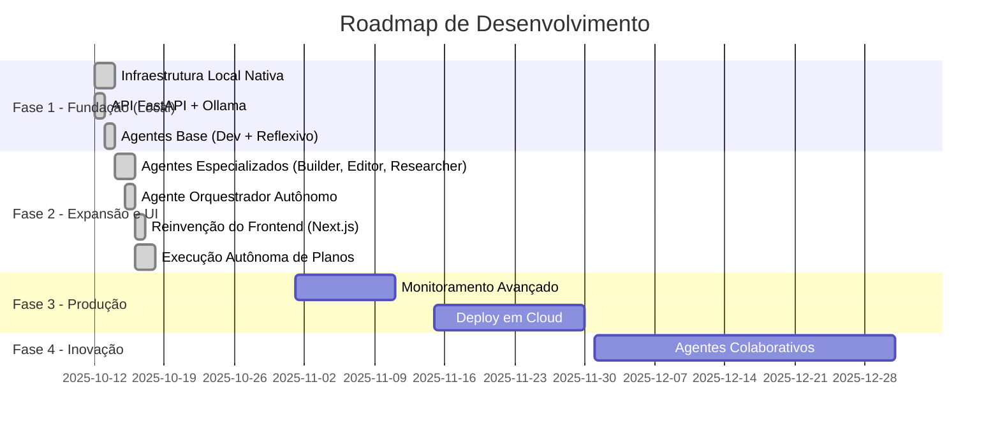

# 🗺️ ROADMAP - Minha Chegada IA

## 📊 Status do Projeto: **FASE 2 - Expansão e Refinamento**

**Última atualização**: 16 de Outubro, 2025  
**Versão Atual**: 2.1.0 (dev)
**Progresso Geral**: ███████████████░░░░░░░ 75%

---

## 🎯 Visão Geral das Fases



---

## ✅ FASE 1 - FUNDAÇÃO (COMPLETA)

### ✨ **Sistema Base Local** - 100% ✅

| Componente | Status | Detalhes |
|------------|--------|----------|
| **Execução Local Nativa** | ✅ | Ambiente Python `venv`, sem Docker. |
| **FastAPI Orquestradora** | ✅ | API REST com 25+ endpoints. |
| **Ollama Integration** | ✅ | Comunicação estável com modelos locais via CPU/GPU. |
| **Gerenciador de Histórico**| ✅ | Salva e carrega conversas em `data/conversations`. |
| **Gerador de Projetos** | ✅ | Salva projetos completos em `data/generated_projects`. |
| **Scripts de Automação** | ✅ | `run_local.ps1` para inicialização simplificada. |

---

### 🤖 **Agentes Base** - 100% ✅

| Agente | Modelo | Capacidades | Status |
|--------|--------|-------------|--------|
| **DevFullstack** | qwen2.5:7b | Code gen, debug, architecture | ✅ |
| **Reflexivo** | phi3:3.8b | Analysis, planning, review | ✅ |

**Arquivos Implementados:**
- ✅ `api/agents/base.py` - Classe base de agentes
- ✅ `api/agents/dev_fullstack.py` - Desenvolvedor fullstack
- ✅ `api/agents/reflexivo.py` - Agente reflexivo

---

## 🚀 FASE 2 - EXPANSÃO E REFINAMENTO (75% COMPLETA)

### 🎨 **Frontend Moderno com Next.js** - 100% ✅

| Feature | Status | Detalhes |
|---------|--------|----------|
| **Stack Moderna** | ✅ | Next.js, React, TypeScript, Tailwind CSS. |
| **Layout Profissional** | ✅ | Estrutura de duas colunas (Sidebar + Chat). |
| **Componentização** | ✅ | `Sidebar` para projetos e `ChatView` para conversas. |
| **Estilização** | ✅ | Tailwind CSS para um design moderno e responsivo. |

### 🎯 **Novos Agentes Especializados** - 100% ✅

| Agente | Propósito | Status |
|--------|-----------|--------|
| **Builder** | Cria projetos completos com múltiplos arquivos. | ✅ |
| **Editor** | Modifica arquivos de código existentes. | ✅ |
| **Researcher**| Busca informações atualizadas na web. | ✅ |
| **Orquestrador**| Cria planos de ação autônomos para atingir objetivos complexos. | ✅ |

---

### 🧠 **Execução Autônoma de Planos** - 100% ✅

| Feature | Status | Descrição |
|---------|--------|-----------|
| **Geração de Plano** | ✅ | Orquestrador gera um plano JSON com múltiplos passos. |
| **Visualização do Plano** | ✅ | Interface exibe o plano para o usuário. |
| **Execução Passo a Passo** | ✅ | Interface executa cada tarefa via API. |
| **Feedback em Tempo Real**| ✅ | A interface agora mostra o status de cada passo (Pendente, Em Andamento, Concluído, Falhou). |
| **Execução Totalmente Autônoma**| ✅ | Um botão "Executar Plano Completo" permite a execução sequencial sem intervenção. |

---

## 🏗️ FASE 3 - PRODUÇÃO E ESCALA (PLANEJADA)

### 📊 **Monitoramento e Métricas Avançadas** - 0% 🔲

| Feature | Status | Tecnologia | Prioridade |
|---------|--------|------------|------------|
| Métricas de Performance | 🔲 | Prometheus | Alta |
| Dashboards Visuais | 🔲 | Grafana | Alta |
| Logs Centralizados | 🔲 | ELK Stack | Média |
| Alertas Automáticos | 🔲 | AlertManager | Média |
| Tracing Distribuído | 🔲 | Jaeger | Baixa |

**Métricas a Monitorar:**
- Latência de resposta por modelo
- Taxa de sucesso/falha por agente
- Uso de recursos (CPU, RAM, GPU)
- Throughput de requisições
- Cache hit rate
- Tempo de roteamento

**Arquivos a Criar:**
- 🔲 `api/middleware/metrics.py` - Coleta de métricas
- 🔲 `monitoring/prometheus.yml` - Configuração Prometheus
- 🔲 `monitoring/grafana/dashboards/` - Dashboards
- 🔲 Atualizar `docker-compose.yml` com stack de monitoring

**Estimativa**: 2-3 semanas | **Complexidade**: Média

---

### 🚀 **Deploy em Cloud** - 0% 🔲

| Plataforma | Status | Requisitos |
|------------|--------|------------|
| **AWS** | 🔲 | ECS/EKS, RDS, S3 |
| **Google Cloud** | 🔲 | GKE, Cloud SQL, Storage |
| **Azure** | 🔲 | AKS, PostgreSQL, Blob |
| **DigitalOcean** | 🔲 | Kubernetes, Managed DB |

**Features de Deploy:**
- [ ] Terraform/Pulumi IaC
- [ ] CI/CD automatizado (GitHub Actions)
- [ ] Auto-scaling configurado
- [ ] Load balancer
- [ ] CDN para assets estáticos
- [ ] Backup automatizado
- [ ] Disaster recovery

**Arquivos a Criar:**
- 🔲 `infra/terraform/` - Infrastructure as Code
- 🔲 `.github/workflows/deploy.yml` - CI/CD pipeline
- 🔲 `kubernetes/` - Manifests K8s
- 🔲 `scripts/deploy.sh` - Script de deploy

**Estimativa**: 3-4 semanas | **Complexidade**: Alta

---

## 🔮 FASE 4 - INOVAÇÃO E IA AVANÇADA (PLANEJADA)

### 🤝 **Agentes Colaborativos** - 0% 🔲

**Objetivo**: Agentes trabalhando em conjunto de forma mais fluida.

| Feature | Status | Descrição |
|---------|--------|-----------|
| **Workflow Orquestrado** | 🔲 | Ideator → Architect → Builder pipeline |
| **Comunicação Entre Agentes** | 🔲 | Message passing e shared context |
| **Execução Paralela** | 🔲 | Tarefas independentes simultâneas |
| **Validação Cruzada** | 🔲 | Um agente valida saída de outro |

**Exemplo de Workflow:**
```
User Input → Ideator (gera ideia) 
          → Architect (design sistema)
          → Builder (scaffolding)
          → DevFullstack (implementação)
          → Reflexivo (review e otimização)
```

**Arquivos a Criar:**
- 🔲 `api/orchestrator/workflow.py` - Orquestração de workflows
- 🔲 `api/orchestrator/agent_communication.py` - Comunicação
- 🔲 `api/services/collaboration_service.py` - Serviço de colaboração

**Estimativa**: 4-5 semanas | **Complexidade**: Muito Alta

---

### 🧪 **Executor de Código Seguro** - 0% 🔲

| Feature | Status | Descrição |
|---------|--------|-----------|
| **Sandbox Docker** | 🔲 | Execução isolada de código |
| **Timeout Configurável** | 🔲 | Limite de tempo de execução |
| **Restrições de Recursos** | 🔲 | CPU, RAM, Disk limitados |
| **Validação de Segurança** | 🔲 | Análise estática antes de executar |

**Arquivos a Criar:**
- 🔲 `api/services/code_executor.py` - Executor de código
- 🔲 `api/sandbox/` - Ambiente sandbox
- 🔲 Endpoint `/execute/code`

**Estimativa**: 2-3 semanas | **Complexidade**: Alta

---

### 🌐 **Multi-Modal Avançado** - 0% 🔲

| Feature | Status | Descrição |
|---------|--------|-----------|
| **Análise de Imagens** | 🔲 | Vision models (LLaVA, GPT-4V) |
| **Geração de Código a partir de UI** | 🔲 | Screenshot → código React |
| **OCR Inteligente** | 🔲 | Extração de texto de imagens |
| **Análise de Vídeo** | 🔲 | Descrição e insights de vídeos |

**Arquivos a Criar:**
- 🔲 `api/services/vision_service.py` - Análise de imagens
- 🔲 `api/tools/ocr.py` - OCR engine
- 🔲 Endpoints `/analyze/image`, `/analyze/video`

**Estimativa**: 5-6 semanas | **Complexidade**: Muito Alta

---

## 📈 Métricas de Progresso

### Por Fase

| Fase | Progresso | Status |
|------|-----------|--------|
| **Fase 1 - Fundação** | 100% | ✅ COMPLETA |
| **Fase 2 - Expansão** | 100% | ✅ COMPLETA |
| **Fase 3 - Produção** | 0% | 📋 PLANEJADA |
| **Fase 4 - Inovação** | 0% | 🔮 FUTURA |

### Por Categoria

| Categoria | Items | Completos | Progresso |
|-----------|-------|-----------|-----------|
| **Infraestrutura** | 6 | 6 | 100% ✅ |
| **Agentes** | 9 | 9 | 100% ✅ |
| **Frontend** | 4 | 4 | 100% ✅ |
| **Execução Autônoma**| 5 | 5 | 100% ✅ |
| **Monitoramento** | 5 | 0 | 0% 🔲 |
| **Deploy** | 7 | 0 | 0% 🔲 |
| **IA Avançada** | 10 | 0 | 0% 🔲 |

---

## 🎯 Próximos Passos Imediatos

1. **Iniciar a Fase 3: Produção e Escala** 🚀
   - Começar a implementação do monitoramento com Prometheus e Grafana.
   - Planejar a infraestrutura como código (Terraform/Pulumi) para o deploy em nuvem.

2. **Melhorar Gerenciamento de Projetos** 📂
   - Implementar a visualização da árvore de arquivos dos projetos gerados diretamente na interface.
   - Adicionar a funcionalidade de deletar projetos pela interface.

3. **Refinar Agentes** ✨
   - Melhorar a capacidade do Editor de aplicar modificações complexas.
   - Aumentar a base de conhecimento do Builder com mais templates.

---

**🚀 Vamos construir o futuro da IA local juntos! - Manifesto "Escrita Sincerta"**
